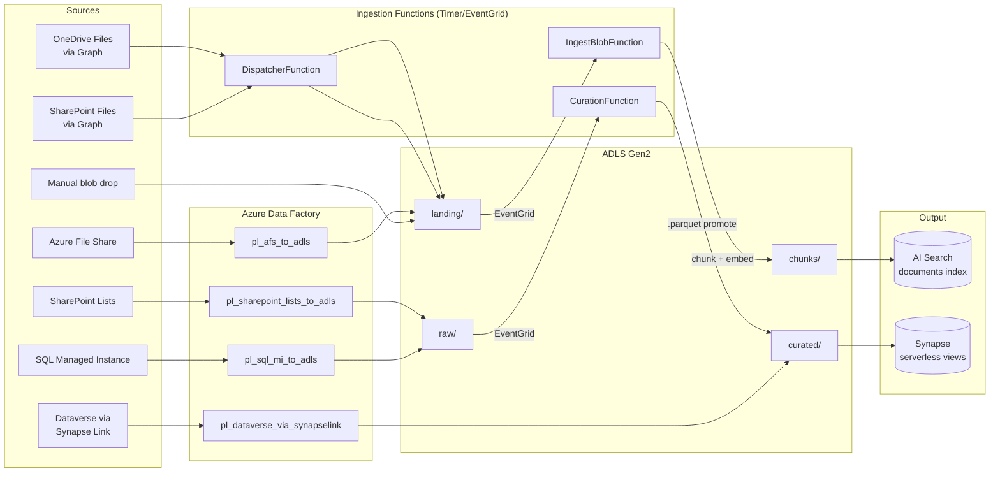

# Ingestion Guide

> **Audience.** This is the central reference for everyone who needs to *get data into* the Data + AI MCP platform — operators wiring up a new data source, developers extending the platform with a new source type, and SREs investigating why a document didn't make it into the index.

This guide is the **hub**. Each individual data source has its own **cookbook** in [`docs/ingestion/`](ingestion/) with step-by-step onboarding. Use the table in §7 to jump straight to the source you care about.

## 1. How to read this guide

| You are... | Start here |
| --- | --- |
| **Operator** onboarding a new tenant or data source | §3 (containers), §7 (per-source matrix), then the cookbook for your source |
| **Developer** adding a brand-new source type | [adding-a-source-type.md](ingestion/adding-a-source-type.md), then §10 in this hub |
| **SRE** investigating an ingestion failure | §8 (operator tasks), §9 (failure modes) |
| **Security reviewer** validating ACL semantics | §5 (ACL model), §5.1 (structured-data caveat) |

Every page links back here. There is exactly **one** Mermaid diagram in the entire ingestion docset (§2 below); per-source cookbooks use ASCII data-flow blocks for parity with [`docs/README.md`](README.md).

## 2. Ingestion at a glance



Key components in the codebase:

- [`src/DataAiMcp.Ingestion.Functions/IngestBlobFunction.cs`](../src/DataAiMcp.Ingestion.Functions/IngestBlobFunction.cs) — Document RAG entry point (`landing/` blob → chunks → embeddings → search index)
- [`src/DataAiMcp.Ingestion.Functions/CurationFunction.cs`](../src/DataAiMcp.Ingestion.Functions/CurationFunction.cs) — Promotes `.parquet` from `raw/` to `curated/`
- [`src/DataAiMcp.Ingestion.Functions/DispatcherFunction.cs`](../src/DataAiMcp.Ingestion.Functions/DispatcherFunction.cs) — Timer-driven source dispatcher (`ISourceFetcherFactory`) → `landing/`
- [`src/DataAiMcp.Ingestion.Functions/Pipeline/DocumentIngestionPipeline.cs`](../src/DataAiMcp.Ingestion.Functions/Pipeline/DocumentIngestionPipeline.cs) — The shared multi-stage pipeline
- [`src/DataAiMcp.Ingestion.Functions/Graph/GraphFileFetcher.cs`](../src/DataAiMcp.Ingestion.Functions/Graph/GraphFileFetcher.cs) — `securityIds` resolution

## 3. Container layout

All ingestion uses a single ADLS Gen2 storage account with **RBAC-only** access (no shared keys, no SAS for the platform identities). Container/filesystem layout:

| Filesystem | Owner | Content | Lifecycle |
| --- | --- | --- | --- |
| `landing/` | Functions + ADF | Raw payloads (PDF, DOCX, XLSX, etc.) with `securityIds` blob metadata | Stays until reingested or pruned |
| `raw/` | ADF + manual | Source-shaped Parquet (e.g., `raw/sqlmi/<schema>.<table>/`) | Pruned per source policy |
| `curated/` | `CurationFunction` + Synapse Link | Promoted Parquet ready for Synapse views | Long-lived |
| `chunks/` | Functions | Per-chunk markdown emitted by `DocumentIngestionPipeline` | Bounded retention; rebuilt on reingest |
| `deploy/` | CI / Terraform | Deployment artifacts (DSC ZIPs, scripts) | Versioned by SHA |

> **No SAS, no account keys.** Every consumer accesses storage via managed identity. The single exception is the Azure File Share storage account key needed by ADF — that is held in Key Vault and referenced by an `AzureKeyVaultSecret` linked-service property; the storage account *we deploy* never exposes a key.

## 4. The two ingestion patterns

### 4.1 Document RAG path (binary blobs → search index)

```
landing/<source>/<path>          (event-grid blob trigger)
        │
        ▼
IngestBlobFunction
   → DocumentIngestionPipeline
        ├─ 1. Document Intelligence layout extraction
        ├─ 2. Markdown serialization (chunks/)
        ├─ 3. Chunker (MarkdownChunker)
        ├─ 4. Embedding (Foundry deployment)
        ├─ 5. Resolve securityIds (Graph or fallback ["__org__"])
        └─ 6. Index upsert (AI Search documents index)
```

Failure of any stage is logged with the source name and the blob path so it can be replayed via the manual reingest task in §8.

### 4.2 Structured data path (Parquet → Synapse views)

```
ADF / Synapse Link writes →   raw/<source>/...
                                    │
                                    ▼ (event-grid .parquet trigger)
                               CurationFunction
                                    │ 1:1 promote
                                    ▼
                              curated/<source>/...
                                    │
                                    ▼
                          Synapse serverless view
                          (defined in infra/synapse/views/)
```

> See §5.1 for the ACL trade-off this pattern makes vs. the document RAG path.

## 5. ACL trimming model

For document RAG (§4.1), every chunk written to the AI Search index carries a `securityIds` field — a list of opaque pseudo-IDs that the MCP server intersects with the **caller's** resolved security IDs at query time. Two pseudo-IDs are reserved:

- `__org__` — Tenant-wide; every authenticated user has it
- `__everyone__` — Truly public; emitted only by explicit operator opt-in

Resolution logic by source:

| Source | securityIds source | Fail-closed? |
| --- | --- | --- |
| SharePoint Files (Graph) | `GraphFileFetcher.ResolveSecurityIdsAsync` resolves drive item permissions to AAD object IDs | **Yes** — Graph 4xx/5xx → empty list → no caller can read |
| OneDrive Files (Graph) | Same as SharePoint Files | **Yes** |
| Manual blob drop | Whatever `securityIds` blob metadata the operator set; defaults to `["__org__"]` if absent | Falls back to `["__org__"]` |
| AFS / SQL MI / SharePoint Lists / Dataverse | Structured path (§4.2); see §5.1 below | N/A — no row-level ACL |

Server-side filter is built in [`src/DataAiMcp.McpServer/Auth/CallerSecurityContext.cs`](../src/DataAiMcp.McpServer/Auth/CallerSecurityContext.cs).

### 5.1 Why structured queries don't enforce `securityIds`

The structured data path (§4.2) writes Parquet to `curated/` and exposes it through Synapse serverless views. **There is no per-row ACL filtering** at query time. A caller that can hit a structured tool (e.g., a SQL MI table view) sees every row in the view.

The trade-off:

- **Document RAG path** filters per-chunk because chunks carry `securityIds` written by the ingestion pipeline. The MCP server intersects the caller's IDs (from `CallerSecurityContext`) with the chunk's IDs at query time.
- **Structured path** has no equivalent because Synapse views read Parquet directly and the platform doesn't synthesize per-row metadata.

Mitigation patterns the operator can apply (in order of preference):

1. **Container-level RBAC scoping.** Move sensitive structured datasets to a separate filesystem (e.g., `curated-restricted/`) and grant `Storage Blob Data Reader` only to a narrower identity. The MCP server's broad reader role then can't see those Parquet files. Pair with separate Synapse views that are not registered as MCP tools.
2. **Tool allowlist.** Restrict which structured tools are exposed to which calling principal via the existing tool-allowlist mechanism in [`src/DataAiMcp.McpServer/Tools/`](../src/DataAiMcp.McpServer/Tools/) (see [`docs/DEVELOPMENT.md`](DEVELOPMENT.md) §7).
3. **Synapse view-level security.** Define views with `WHERE` clauses that join against an authorization table; requires SQL passthrough auth so Synapse runs the query as the caller. **Out of scope** for the platform — operator-driven.

The three structured-source cookbooks ([sql-managed-instance.md](ingestion/sql-managed-instance.md), [sharepoint-lists.md](ingestion/sharepoint-lists.md), [dataverse.md](ingestion/dataverse.md)) all link back to this section.

## 6. Configuration surface

Every ingestion-related app-setting key the platform binds today. Settings whose value is `<deployed>` are populated by Terraform / KV refs at provision time; everything else is operator-supplied via `local.settings.json` (dev) or App Service application settings (prod).

| Key | Bound by | Default (template) | Set in |
| --- | --- | --- | --- |
| `Ingestion__StorageConnection__serviceUri` | `DocumentIngestionPipeline` | `https://<storage>.blob.core.windows.net` | Functions app settings |
| `Ingestion__LandingContainer` | `IngestBlobFunction` | `landing` | Functions app settings |
| `Ingestion__CuratedContainer` | `CurationFunction` | `curated` | Functions app settings |
| `Ingestion__RawContainer` | `CurationFunction` | `raw` | Functions app settings |
| `Ingestion__ChunksContainer` | `DocumentIngestionPipeline` | `chunks` | Functions app settings |
| `Foundry__EmbeddingDeployment` | embedding step | `text-embedding-3-large` | Functions + MCP app settings |
| `Foundry__Endpoint` | embedding step | `<deployed>` | Functions + MCP app settings |
| `Search__Endpoint` | index writer | `<deployed>` | Functions + MCP app settings |
| `Search__IndexName` | index writer | `documents` | Functions + MCP app settings |
| `DocumentIntelligence__Endpoint` | layout extraction | `<deployed>` | Functions app settings |
| `Graph__BaseUrl` | Graph clients | `https://graph.microsoft.com/v1.0` (use `https://graph.microsoft.us/v1.0` for Gov-cloud) | Functions app settings |
| `CosmosDb__Endpoint` | `DispatcherFunction` source config store | `<deployed>` | Functions + Portal app settings |
| `CosmosDb__DatabaseId` | `DispatcherFunction` source config store | `ingestion` | Functions + Portal app settings |
| `CosmosDb__SourceConfigContainerId` | `DispatcherFunction` source config store | `source-configurations` | Functions + Portal app settings |
| `Curation__SourcePrefixes` | `CurationFunction` | `[]` | Functions app settings |

The template is at [`src/DataAiMcp.Ingestion.Functions/local.settings.template.json`](../src/DataAiMcp.Ingestion.Functions/local.settings.template.json).

## 7. Per-source matrix

| Source | Cookbook | Mechanism | Lands at | `documents.source` value | Schedule | Auth |
| --- | --- | --- | --- | --- | --- | --- |
| SharePoint Files | [sharepoint-files.md](ingestion/sharepoint-files.md) | Dispatcher source fetcher (Graph) | `landing/sharepoint/<drive>/<path>` | `sharepoint` | Dispatcher timer (6h default) | Graph + MI |
| OneDrive Files | [onedrive-files.md](ingestion/onedrive-files.md) | Dispatcher source fetcher (Graph) | `landing/onedrive/<drive>/<path>` | `onedrive` | Dispatcher timer (6h default) | Graph + MI |
| Azure File Share | [azure-file-share.md](ingestion/azure-file-share.md) | ADF (`pl_afs_to_adls`) | `landing/afs/<path>` | `afs` | Tumbling window (default 05:00 UTC) | KV-stored AFS storage key + ADF MI |
| SQL Managed Instance | [sql-managed-instance.md](ingestion/sql-managed-instance.md) | ADF (`pl_sql_mi_to_adls`) | `raw/sqlmi/<schema>.<table>/` | n/a (structured) | Tumbling window (default 04:00 UTC) | ADF MI; operator T-SQL grant |
| SharePoint Lists | [sharepoint-lists.md](ingestion/sharepoint-lists.md) | ADF (`pl_sharepoint_lists_to_adls`) | `raw/sharepoint-lists/<list>/` | n/a (structured) | Tumbling window (default 06:00 UTC) | AAD app-reg + KV-stored secret |
| Dataverse | [dataverse.md](ingestion/dataverse.md) | Synapse Link + marker pipeline | `curated/synapselink/...` (Synapse Link writes) | n/a (structured) | Tumbling window probe (default 07:00 UTC) | Power Platform admin-center setup |
| Manual blob drop | [blob-drop.md](ingestion/blob-drop.md) | Operator upload | `landing/<source>/<path>` | operator-set | n/a | Storage RBAC |

## 8. Common operator tasks

### 8.1 Reingest a single document

Re-uploading the blob (or copying it over itself) re-triggers `IngestBlobFunction` via the existing event-grid subscription:

```bash
az storage fs file upload \
  --auth-mode login \
  --account-name <storage> --file-system landing \
  --source ./mydoc.pdf --path sharepoint/<drive>/<path>/mydoc.pdf \
  --overwrite
```

### 8.2 Force a source resync

The dispatcher runs all enabled sources on its timer and updates per-source run status in the source configuration store. To force an earlier run, restart the Functions app (which causes timers to be re-evaluated) and confirm source state in the Portal `Admin/Sources` page.

### 8.3 Clear and rebuild the index

```bash
# Re-run the index provisioner (idempotent; recreates the documents index)
dotnet run --project src/DataAiMcp.Tools.IndexProvisioner -- \
  --search-endpoint https://<search>.search.windows.net --recreate
```

Then trigger reingest of every source (e.g., upload a marker blob to each source path).

### 8.4 Monitor an ingestion run in App Insights

Every ingestion stage emits an OTEL span on the `DataAiMcp` source (set by [`DataAiTelemetry.SourceName`](../src/DataAiMcp.Shared/Telemetry/DataAiTelemetry.cs)). Useful KQL:

```kusto
// Ingestion failures in the last hour
dependencies
| where customDimensions.["service.namespace"] == "DataAiMcp"
| where success == false
| project timestamp, name, target, customDimensions.source, resultCode

// Index latency P95 (drives the search_ingestion_latency alert)
customMetrics
| where name == "ingestion.IndexLatencyMs"
| summarize p95 = percentile(value, 95) by bin(timestamp, 5m)
```

### 8.5 Rotate an operator-managed secret

See [secret-rotation.md](ingestion/secret-rotation.md).

## 9. Common operator failure modes

| Symptom | Likely cause | Diagnostic |
| --- | --- | --- |
| Blob lands but no search hit | Embedding deployment quota exceeded | App Insights: `dependencies` where target contains `cognitiveservices.azure.com` and `resultCode == 429` |
| Blob lands but no search hit | `securityIds` empty (Graph fail-closed) | App Insights: trace where `customDimensions.securityIds == "[]"` for the source path |
| Blob lands but no search hit | Document Intelligence quota | `dependencies` with `target` containing `cognitiveservices` and `name == "Analyze"` |
| `CurationFunction` not promoting | EventGrid subscription deleted on `raw/` | `az eventgrid system-topic event-subscription list` |
| ADF pipeline failed | KV secret missing, expired, or stale value | KQL: `ADFPipelineRun \| where Status == "Failed"`, then look at `Error` column |
| ADF pipeline failed | ADF MI not granted `Key Vault Secrets User` | `az role assignment list --scope <kv-id>` |
| SHIR not online | Auth key not propagated, host VM not reachable | ADF portal → Integration runtimes → status |

## 10. Developer entry points

To add a brand-new source TYPE (e.g., S3, Box, Confluence): see the [adding-a-source-type cookbook](ingestion/adding-a-source-type.md).

To extend an existing source (e.g., add a new SharePoint drive): edit the configuration values listed in §6 — no code change is required.

For the architectural extension points (chunker strategies, embedding adapters, custom `IIndexWriter` implementations): see [`docs/DEVELOPMENT.md`](DEVELOPMENT.md).

## 11. Cross-references

- Deployment + RBAC + Graph admin-consent: [`docs/DEPLOYMENT.md`](DEPLOYMENT.md)
- Local development + testing: [`docs/DEVELOPMENT.md`](DEVELOPMENT.md)
- Architectural overview: [`docs/README.md`](README.md)
- Post-provision script that wires app settings: [`infra/scripts/postprovision.sh`](../infra/scripts/postprovision.sh)
